## 🎱️ Heavy Ball - Hyper Casual Game
A 3D mobile game with important monetization models.
* The tasks for the development are programming, prototyping, designing, and working with the game engine.
* Monetization models are banner ads, interstitial ads, and rewarded video ads.
* A free-to-play casual mobile game with a hyper-casual game style, constructed using 3D elements, built using the Unity game engine.

## 🎮 Game Story
* The story of a mobile game provides its users with a reason to continue playing, it contributes to keeping people interested and hooked for extended periods.
* The basic gameplay of the Ball is moving forward, avoiding obstacles, and reaching the end of the level point.
* Stars are planned to be used as a currency in the future to unlock new ball styles. 
* A track in water is designed such as some other hyper-casual games. 
* In each level, obstacles appear randomly on the track, and every two levels new obstacles will be added.
* The length of the levels is based on the distance of the track, which by going to the next levels the distance of the track would be longer.

## 🕹️ Game Icon

## 📸 ScreenShots

| ..... | ..... |
|-------|-------|
||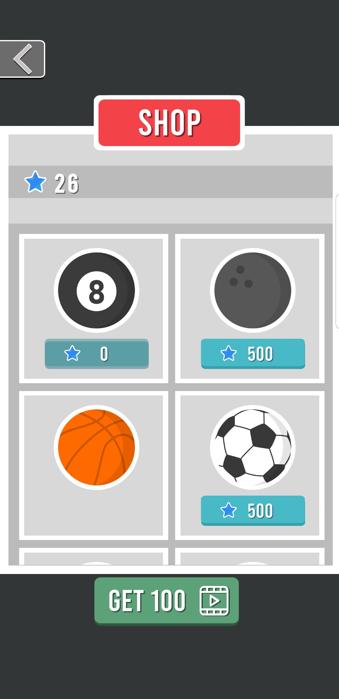|
|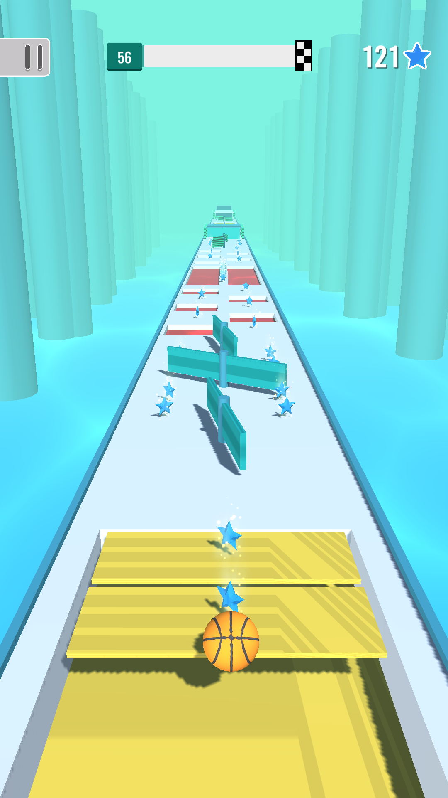|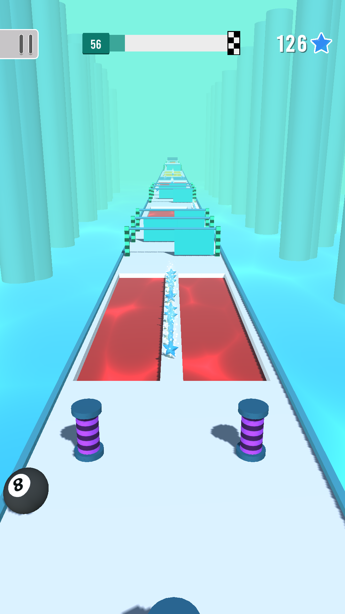|
|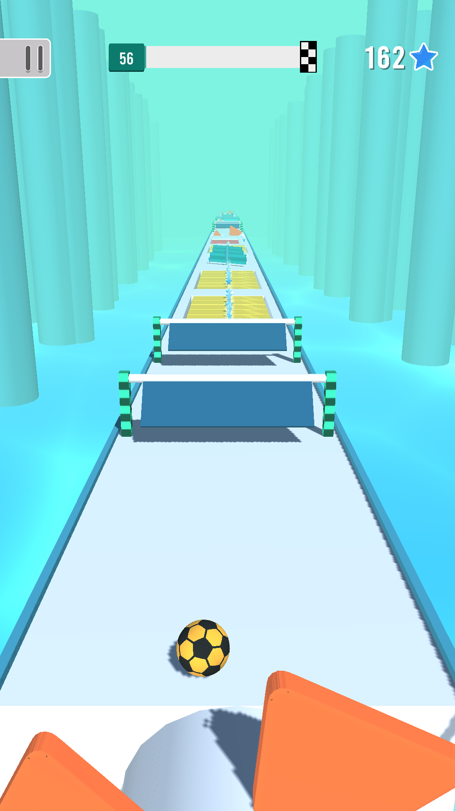|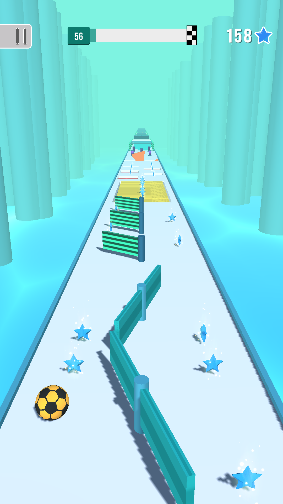|
|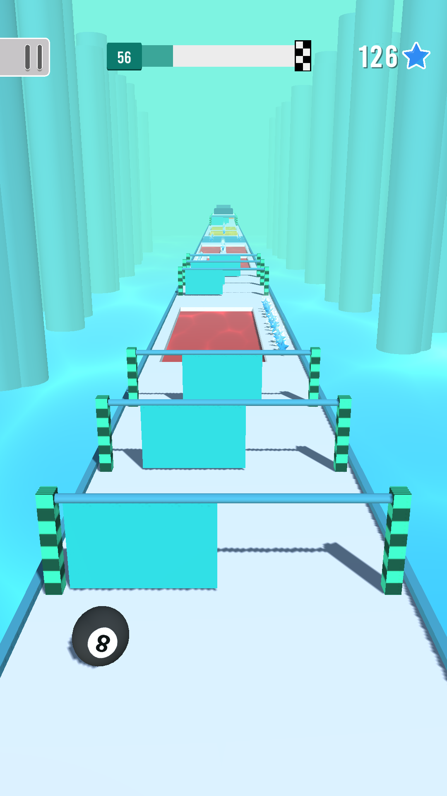|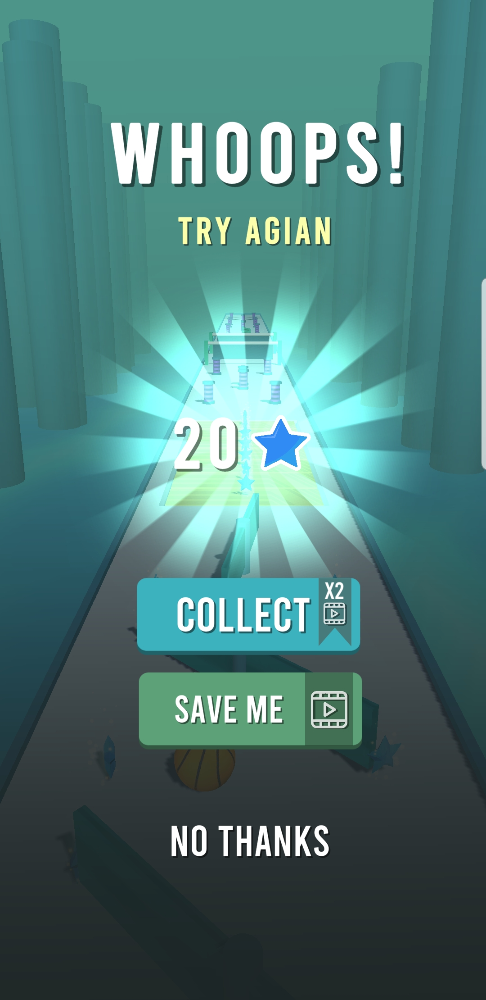|

## 🎞️ GamePlay

https://github.com/rawaone/Heavy-Ball/assets/67627984/23a29cce-6d6a-4af0-9771-2af34ef3ec06

https://github.com/rawaone/Heavy-Ball/assets/67627984/c69f9ed8-f0c5-4278-a80e-d7b8ebd78712

https://github.com/rawaone/Heavy-Ball/assets/67627984/d1ee8ce3-3099-4f7a-8538-d2089487dc35

## Game Idea
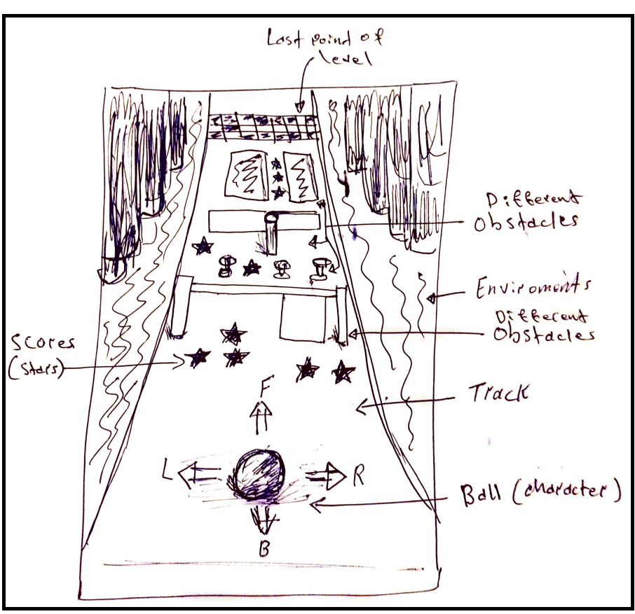

## Use Case Model
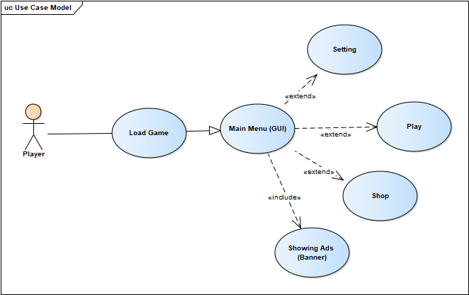

## UML Class Diagram
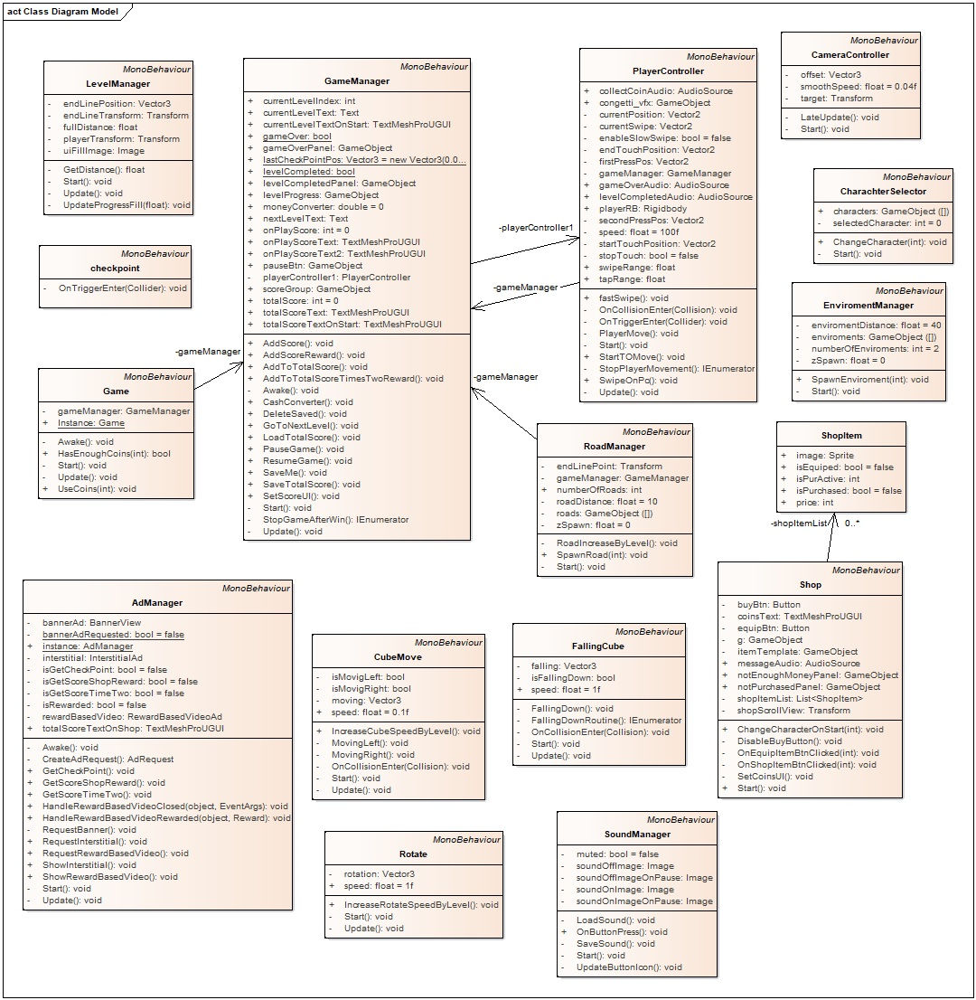

## Sequence Diagram
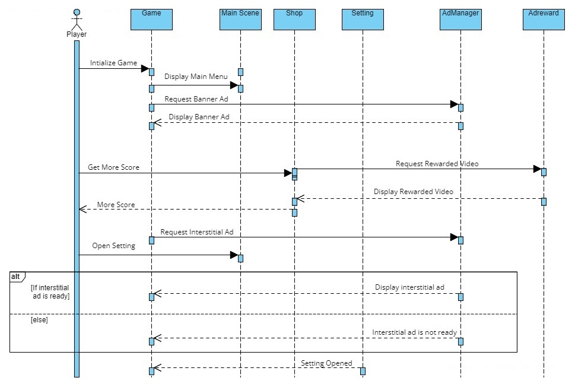

## Activity Diagram
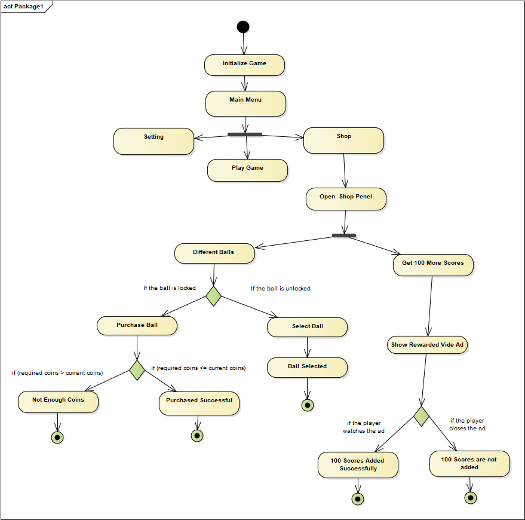

## 🤓 Author(s)
**RAWA TAHIR RASHID**
