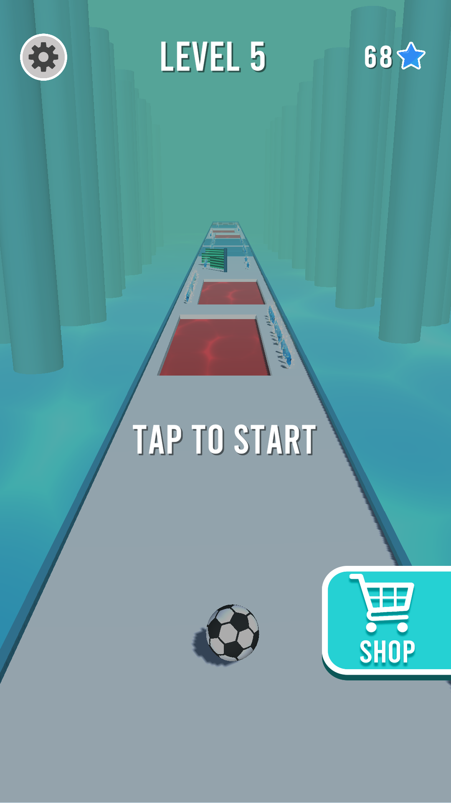

## 🎱️ Heavy Ball - Hyper Casual Game
A 3D mobile game with important monetization models.
* The tasks for the development are programming, prototyping, designing, and working with the game engine.
* Monetization models are banner ads, interstitial ads, and rewarded video ads.
* A free-to-play casual mobile game with a hyper-casual game style, constructed using 3D elements, built using the Unity game engine.

<a href="app.apk"></img></a>

## 🎮 Game Story
* The story of a mobile game provides its users with a reason to continue playing, it contributes to keeping people interested and hooked for extended periods.
* The basic gameplay of the Ball is moving forward, avoiding obstacles, and reaching the end of the level point.
* Stars are planned to be used as a currency in the future to unlock new ball styles. 
* A track in water is designed such as some other hyper-casual games. 
* In each level, obstacles appear randomly on the track, and every two levels new obstacles will be added.
* The length of the levels is based on the distance of the track, which by going to the next levels the distance of the track would be longer.

## 🕹️ Game Icon

## 📸 ScreenShots

| ..... | ..... |
|-------|-------|
|||
|||
|||
|||

## 🎞️ GamePlay

| ..... | ..... |
|-------|-------|
|https://github.com/rawaone/Heavy-Ball/assets/67627984/60e0a335-34b8-4ec1-b698-4f6a1fdeeb3a|https://github.com/rawaone/Heavy-Ball/assets/67627984/bd56994c-c234-4a40-9837-aa3ae86cc39f|
https://github.com/rawaone/Heavy-Ball/assets/67627984/095eb287-89d5-43f7-9a86-7385c97222fc

## 🤓 Author(s)
**RAWA TAHIR RASHID**
